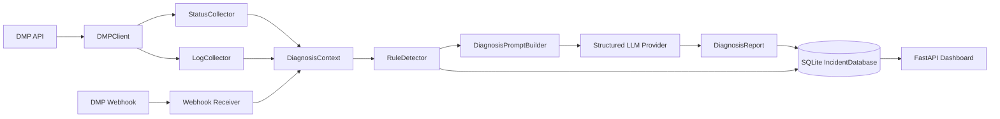
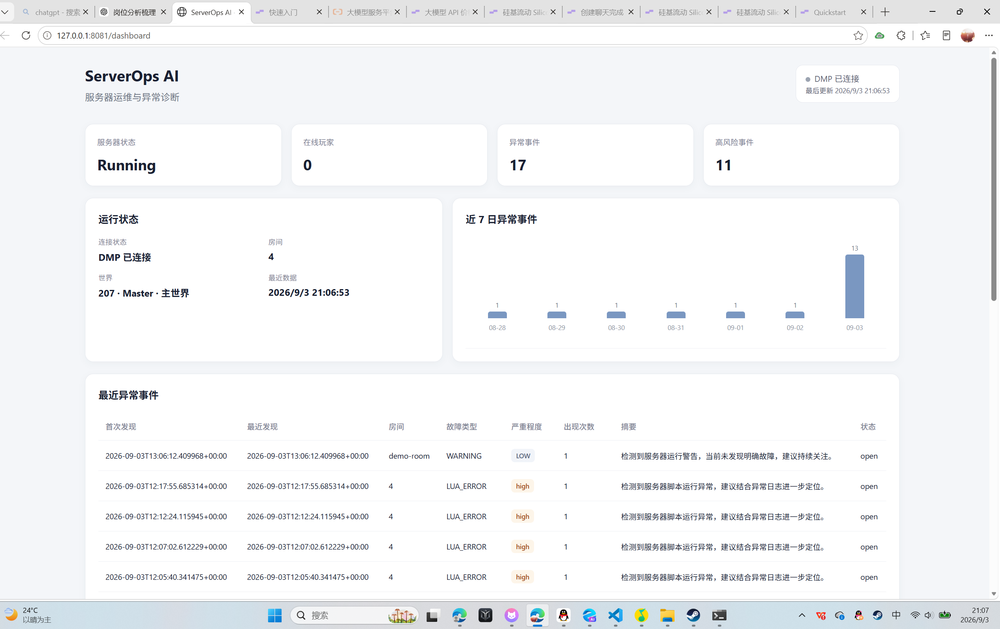
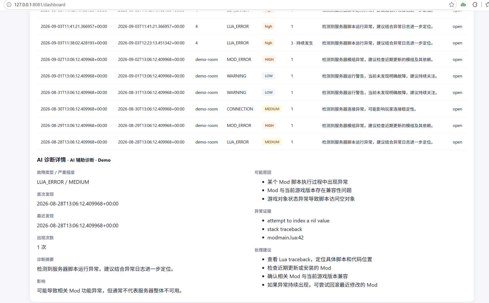

# ServerOps AI

**AI 辅助服务器运维与异常诊断系统**

ServerOps AI 是一个面向 DST（Don't Starve Together）服务器的外部运维分析服务。它通过 DMP 获取服务器状态和游戏日志，先用可解释规则识别异常，再使用结构化 LLM 诊断生成故障记录，并通过 Dashboard 和 Webhook 供运维人员查看或接入其他系统。

## 项目背景

维护游戏服务器时，很多问题首先表现为日志中的几行信息：Lua 脚本异常、MOD 加载失败、连接超时或持续出现的运行警告。人工需要在状态、玩家、日志和历史记录之间反复切换，才能判断问题是否重复发生、影响范围是什么以及下一步该查哪里。

这个项目尝试把这条排查流程串起来：先保留规则检测的确定性，再把有限、相关的上下文交给 AI，最后将诊断结果沉淀为可查询的 Incident。

## 项目概览

ServerOps AI 不是 DST 管理平台本身，而是运行在 DMP 之外的分析层。它目前支持：

- 通过 DMP API 登录并读取房间、世界、系统状态、在线玩家和游戏日志
- 识别常见的 CRASH、LUA_ERROR、MOD_ERROR、CONNECTION、RESOURCE、WARNING 等异常
- 将状态和日志整理为 `DiagnosisContext`
- 通过 Mock 或 SiliconFlow 等结构化 LLM Provider 生成 `DiagnosisReport`
- 将 Incident 保存到 SQLite
- 对重复的 open Incident 使用 fingerprint 合并统计
- 提供一个只读 Dashboard
- 接收 DMP Webhook，并对 `keepalive_triggered` 事件进行后台诊断

## 核心流程

```text
DST 服务器 / DMP
        │
        ▼
状态与游戏日志获取
        │
        ▼
规则异常检测（RuleDetector）
        │
        ▼
诊断上下文提取（DiagnosisContext）
        │
        ▼
Prompt 构造与 LLM 辅助诊断
        │
        ▼
结构化 DiagnosisReport
        │
        ▼
Incident 持久化与重复合并
        │
        ├──► Dashboard
        └──► Webhook 事件入口 / 外部系统
```

## 核心功能

### DMP API 对接

`DMPClient` 使用 DMP 的账号密码登录机制，并在内存中维护认证状态。当前客户端封装了：

- 房间列表
- 房间基础状态和 worlds 信息
- 系统状态
- 房间在线玩家
- 指定房间、世界和日志类型的游戏日志

凭据通过配置文件或环境变量提供，不写入前端，也不应提交到仓库。

### 状态与日志采集

`StatusCollector` 获取房间、系统和在线玩家状态；`LogCollector` 获取有限行数的日志，并对滑动窗口进行简单的增量去重。`DiagnosisContext` 将事件时间、房间、世界、状态、日志和采集错误组织成统一输入。

### 异常检测

规则检测覆盖常见的：

- `CRASH`
- `LUA_ERROR`
- `MOD_ERROR`
- `CONNECTION`
- `RESOURCE`
- `WARNING`

规则结果包含故障类型、严重程度、置信度、匹配证据和相关日志行，便于后续诊断和解释。

### LLM 辅助诊断

系统提供：

- `MockLLMProvider`：本地验证和 Demo 使用
- `SiliconFlowLLMProvider`：调用 OpenAI 兼容的 Chat Completions 接口

LLM 输出会经过 JSON 解析，形成包含故障类型、严重程度、摘要、可能原因、证据、影响和处理建议的 `DiagnosisReport`。LLM 不可用时，现有轮询链路会保留规则检测结果；这类内部状态不会作为 Dashboard 的业务摘要展示。

### SQLite Incident

Incident 存储在现有 SQLite 数据库中，保存规则或 AI 诊断相关字段，包括：

- 故障类型与严重程度
- 摘要、可能原因、证据、影响和处理建议
- 首次发现时间与最近发现时间
- 当前状态
- `fingerprint`
- `occurrence_count`

重复的 open Incident 不会无限新增记录，而是更新出现次数和最近发现时间。不同房间、世界、故障类型或核心证据仍可形成不同 Incident。

### Dashboard

Dashboard 使用 FastAPI 内嵌 HTML/CSS/JavaScript 实现，不依赖 Vue、React 等前端框架。页面目前展示：

- DMP 连接状态、服务器状态、在线玩家和异常统计
- 房间与世界信息
- 近 7 日异常事件总数趋势
- 最近 Incident 列表
- Incident 的 AI 辅助诊断详情
- Demo 数据标识

页面访问地址通常为：

```text
http://127.0.0.1:8081/dashboard
```

### Webhook

可选的 FastAPI Webhook 接收入口为 `POST /webhook/dmp`。当启用签名校验时，服务使用配置的 secret 校验 `X-DMP-Signature`。收到 `keepalive_triggered` 后，系统会在后台采集上下文、执行规则检测和结构化诊断，并保存 Incident。

Webhook 是否启用由配置决定；默认示例配置中为关闭状态。

## 系统架构



## AI 诊断

AI 不是直接接收整份日志。当前链路是：

1. 先读取有限范围的服务器状态和日志
2. 使用规则发现异常类型并提取匹配证据
3. 组装 `DiagnosisContext`
4. 使用 `DiagnosisPromptBuilder` 限制日志数量并过滤敏感字段
5. 调用 Mock 或 SiliconFlow Provider
6. 解析 JSON 为 `DiagnosisReport`
7. 将报告保存为 Incident

这样做的目的，是让规则负责快速、可解释的初筛，让模型负责摘要、可能原因、影响和建议，而不是把所有判断都交给模型。

## Dashboard

Dashboard 页面提供服务器运行概况、近 7 日异常趋势、最近异常列表和诊断详情。





## 故障记录与去重

每个 Incident 会根据以下信息生成稳定 fingerprint：

- `room_id`
- `world_id`
- `fault_type`
- 归一化后的核心异常证据

当相同 fingerprint 的 Incident 仍处于 `open` 状态时，系统会：

- 保留原 Incident
- 增加 `occurrence_count`
- 更新 `last_seen`

`detected_at` 用于记录首次发现时间，Dashboard 对外展示为 `first_seen`。该机制用于减少轮询滑动窗口导致的重复事件，同时不会把所有 Lua 错误粗略合并为一个事件。

## 我的工作

这是一个个人项目。我围绕真实的 DST/DMP 运维场景，独立完成了：

- DMP API 客户端和认证流程
- 状态与游戏日志采集
- 可解释规则检测
- `DiagnosisContext`、Prompt 构造和结构化诊断报告
- Mock 与 SiliconFlow Provider 接口
- SQLite Incident 持久化、兼容迁移和重复事件去重
- DMP Webhook 接收与后台诊断链路
- 面向展示和查询的 Dashboard


项目用于展示完整的 AI 应用流程，不代表已经完成商业化落地或大规模生产部署。

## 技术栈

- Python
- FastAPI
- Uvicorn
- SQLite
- `requests`
- PyYAML
- `python-dotenv`
- HTML / CSS / JavaScript
- OpenAI 兼容的 LLM HTTP 接口

## 项目运行

进入 `serverops-ai` 目录后安装依赖：

```bash
python -m pip install -r requirements.txt
```

准备配置文件：

```bash
copy config.yaml.example config.yaml
```

在本地 `.env` 或 `config.yaml` 中配置 DMP 连接信息。常用环境变量包括：

```text
DMP_BASE_URL=你的DMP地址
DMP_USERNAME=你的DMP用户名
DMP_PASSWORD=你的DMP密码
SERVEROPS_ROOM_ID=目标房间ID
```

启动监控、Dashboard 和配置中启用的 Webhook：

```bash
python -m app.main
```

只执行一次采集和检测：

```bash
python -m app.main --once
```

生成明确标记为 Demo 的 Incident 数据：

```bash
python -m app.main --seed-demo
```

启动后访问：

```text
python -m app.main
http://127.0.0.1:8081/dashboard
```

## 项目说明

### 真实服务器 / DMP 联调

真实模式通过配置的 DMP 地址、账号和房间进行读取。程序会调用 DMP 获取状态、在线玩家和游戏日志；是否能读取到具体数据取决于 DMP 服务、权限和目标房间当前状态。

### Demo / 演示数据

`--seed-demo` 写入的是明确标记为 `demo_test_data` 的本地 SQLite 演示记录，用于展示不同故障类型、趋势和 AI 辅助诊断详情。Demo 不代表真实服务器事故，也不会替代真实 DMP 数据。

### LLM 可用性

Mock Provider 可用于不访问外部模型的本地验证。SiliconFlow Provider 需要有效的环境变量密钥和可用网络；外部模型的响应速度、可用性和返回结果不由本项目保证。

## 当前边界

- 当前项目是轻量运维分析工具，不包含自动修复、远程 Shell 执行、MOD 安装或服务器控制面板。
- Dashboard 主要读取本地 Incident 和监控进程共享的状态快照。
- 未提供完整的用户权限系统、任务队列或高可用部署方案。
- 真实数据联调和 Demo 数据展示需要区分，不能把 Demo 记录当作生产故障统计。
